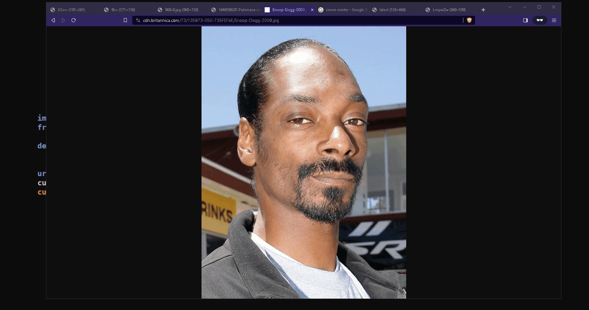

# Scan Monitor for Faces
Facial recognition while using your PC or watching content

> **Note:** This project is still in development, and there's more to be done. Currently, I am too busy to continue the work.
> It is designed to run on windows, not via WSL due to capturing graphics card.

- Don't make fun of my genius. Instead of manually applying labels or exif to each image for names this was just an easier process.
- Make sure you edit which monitor it watches in the `screen_watcher.py` script.

## How it works

1. First it downloads the specified video from YouTube.
2. Now it extracts the faces and for each face it adds exif specifying the title of the video and URL
3. Preprocess is run to find landmarks for each face and a file face_encodings.json is created with a link to each face in the collection
4. Finally the `screen_watcher` is run which will monitor well... your monitor and when a face appears that is in the database, will highlight it and give a name based on the information we have.

- All faces are recognized, but only boxes are drawn for the ones that match a picture in our collection.

## Instructions

1. **Extract Faces from YouTube Videos**
   - Run the `youtube_extractor.py` script.
   - The script will download YouTube videos, extract all the faces, and organize them into the correct folder structure.

2. **Preprocess Faces**
   - Execute the `preprocess.py` file.
   - This script will generate a `face_encodings.json` file, which includes the ID values for each extracted face.

3. **Monitor Screen for Faces**
   - Start the `screen_watcher.py` file.
   - This script will monitor your screen for faces. When it detects a face, it will overlay a box around the face. By default, the name will display as "unknown."

## Adding New Faces to the Recognition System

- Inside the numbered folder, create a subfolder with the name of the person (e.g., "Eminem").
- Move all images of the individual (Eminem in this case) to this folder.
- **Important:** Re-run `preprocess.py` after any changes to the file structure to update face encodings and IDs.

## Recognition Name Display

- When a face is recognized, the system will display the name of the folder where the images were found.
- If the system finds the same person's face in multiple folders, the display will show as "Person's Name (Probably)" to indicate uncertainty.

